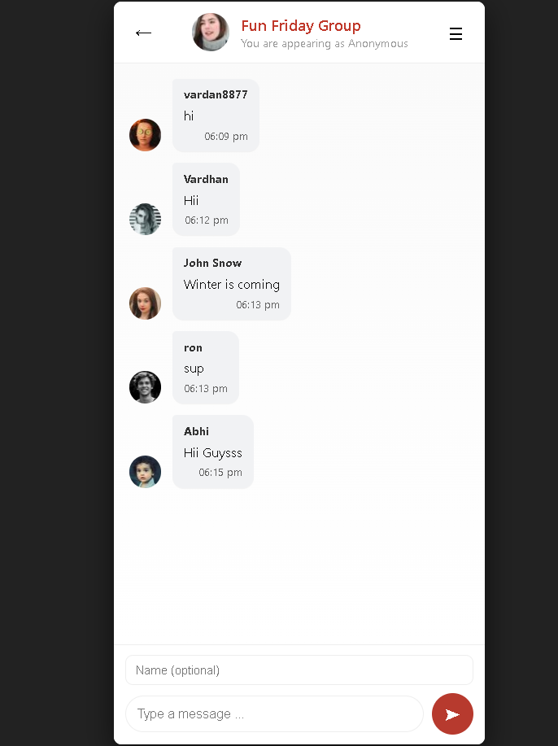

# Simple Chat App

A beginner-friendly real-time chat application built with **Node.js, Express, Socket.IO, MySQL, HTML, CSS, and JavaScript**. Messages are persisted in a MySQL database and the UI mimics a mobile chat interface.

---

## Features

- Real-time messaging using **Socket.IO**
- Persistent chat messages using **MySQL**
- Mobile-style chat UI with message bubbles
- Optional username input (defaults to "Anonymous")
- Works on local network or single machine

---

## Screenshots

